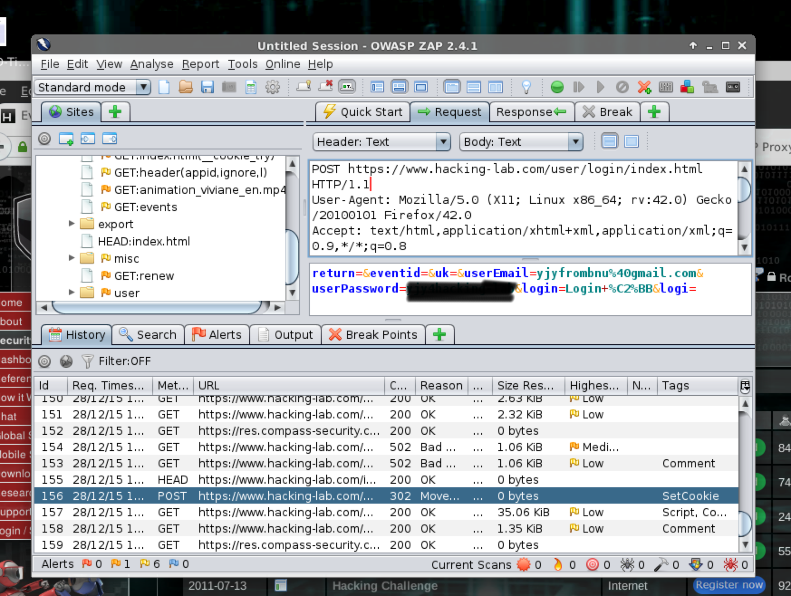
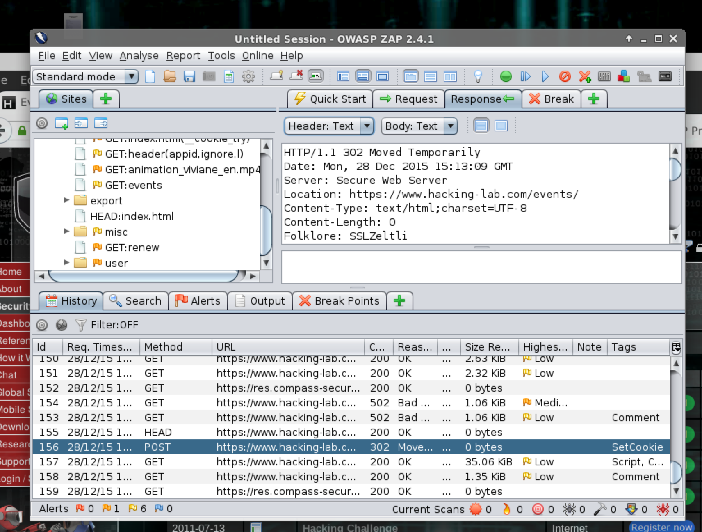
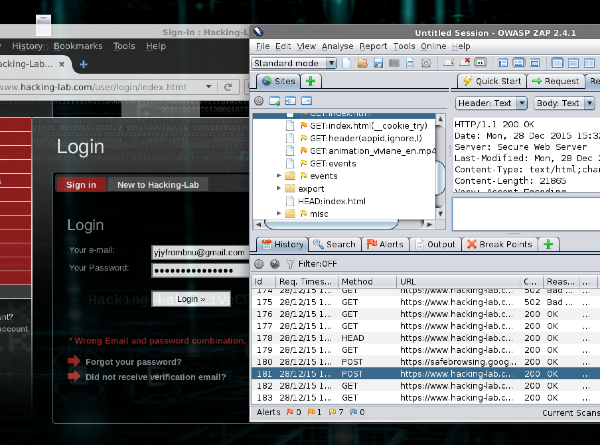
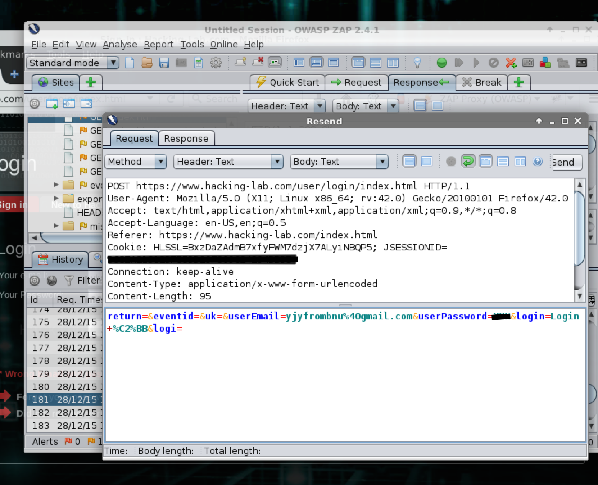

# The writeup for 1600 LiveCD Intro Challenge: ZAP Proxy

## Introduction
This is a writeup for learning how to use ZAP Proxy.

## Steps
The mission is to analyse the web requests between your browser and www.hacking-lab.com.
### Login request
The request is a POST request with URL https://www.hacking-lab.com/user/login/index.html. The login parameters are userEmail and userPassword. However, the password is transported in plaintext.

The snapshot is followed.

### Server response (succeeded)
After successful authentication, the server sent a 302 Moved Temporarily response with URL https://www.hacking-lab.com/events/

The snapshot is followed.

### Server Response (failed)
If I input a wrong password, the server will send a 200 OK response. The content of website will show a error message 'Wrong Email and password combination'.

The snapshot is followed.

### Resend Feature
The resend feature can be used by right clicking the login request item, and choosing resend item. And then the http parameters can be modified manually.

The snapshot is followed.

## Conclusion
This is a beginner practice for ZAP Proxy. The trap and resend feature is cool.
