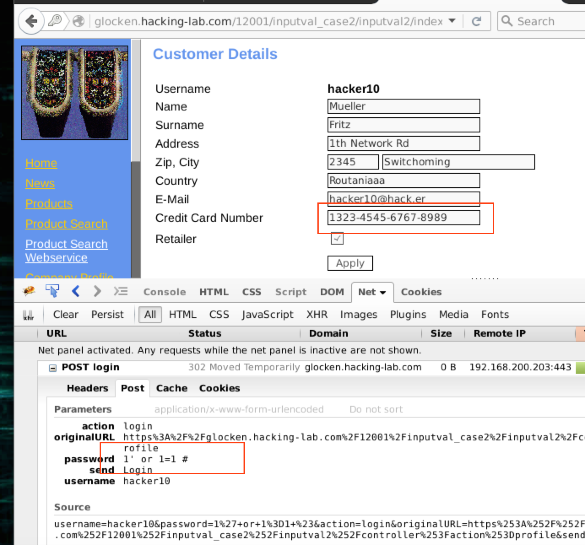

# The writeup for 6111 SQL Injection Attack

## Introduction
The mission is to exploit a vulnerability by a SQL injection attack. The authentication mechanism should be bypassed.

## Exploit
I plan to construct the attack vector as follows.

`Password=1' or 1=1 #`

In this case, the SQL query might be:

`SELECT * from users where user='hacker10' and password='1' or 1=1 # ' `

The logic 1=1 will guarantee the expression to be True no matter what the password is given.

## Proof
After I inputed the attack vector, the authentication mechanism is bypassed and I am able to view the user's profile which contains the credit-card details (1323-4545-6767-8989).

The snapshot is followed.

## Mitigation
The general mitigation to SQL injection is to use precompiled sql statement and stored procedure. And never concatenate SQL with user input.